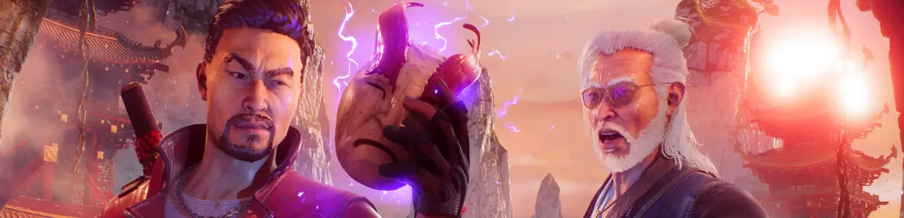

+++
date = '2024-11-22T00:18:34+01:00'
draft = true
title = 'On Shadow Warrior 3: We Have DOOM Eternal At Home'
tags = ['game design', 'fps', 'shadow warrior', 'doom', 'doom eternal']
summary = 'After switching gears to resemble Borderlands, Shadow Warrior is yet again switching gears to not-so-subtly resemble the modern DOOM games. Does it have anything interesting to add to the conversation?'
ShowCanonicalLink = true
CanonicalLinkText = 'Originally published at'
canonicalURL = 'https://www.backloggd.com/u/Durandal/review/1686904/'
blueskyPostUri = 'https://bsky.app/profile/testamentenjoyment.bsky.social/post/3l7aqo3bysx2t'
listEntryImage = './catalog-cover.webp'
+++

Rather than ape DOOM/Duke Nukem or Borderlands, this time around Shadow Warrior is aping Doom 2016/Eternal in many ways impossible not to notice. Shadow Warrior 3 has most of Doom 2016/Eternal’s fundamentals down pat, but in doing so it also inherited Doom 2016/Eternal’s core flaws: an overreliance on “scramble encounters”[^1] coupled with forgiving resource replenishment and non-committal mobility/weapon selection in a campaign whose encounters start blurring together once it stops introducing new combat elements. Encounters may be technically distinct in terms of enemies used and arena layout, but they are not meaningfully distinct in terms of the strategy required to approach them. It’s like a Pacman game where new stages only have different layouts but no notable gimmicks. Here SW3 is no exception. However, SW3 does make some tweaks to the formula that may or may not work out.

The most noticeable one is that unlike Doom 2016/Eternal, there is no scaling on health drops. DE would increase health drops on enemy kills if you were low on health, but in SW3 this scaling is nowhere as present. Health is usually replenished at a linear rate rather than in big bursts; it is always dropped when hitting/killing enemies with guns. The main consequence of this is that you can’t easily make big comebacks like in DE. At low health you actually have to start thinking a little about how to stay alive long enough to restore your health[^2]. This also means that compared to DE you are way more reliant on item spawners in arenas to stay stocked. It helps that there is no secondary health/armor bar in SW3, too.
The increased reliance on item spawners opens the possibility for arena design to finally play a greater role in resource management. Rather than running laps around the arena on auto-pilot, you could be moving towards specific points and items in the arena with some intent in mind. One recurring issue in Doom Eternal and similar “arena shooters” is that staying on the move is more important than moving towards a specific spot. You’d need to spawn in a massive boon or threat like a power-up or Buff Totem to get the player to start thinking of a route. A lack of routing led to the majority of a given encounter taking place in a random corner of the arena or generally kind of everywhere, in turn playing a major part in making encounters and arena designs feel too identical to one another. If you were to draw a [value diagram](https://andrewyoderdesign.blog/2019/08/04/the-door-problem-of-combat-design/) for most arenas in DE, most of them would look like an even spread of minor advantages and disadvantages, but rarely ever something major.

Despite item spawners playing a greater role, SW3 is no exception here either. What the greater importance of item spawners does accomplish is that you’ll be making laps around the entire arena more often to pass by as many spawners as possible, but how or when or where you must go about making these laps is rarely ever fundamentally shaken up—the old problem of being technically different but not meaningfully different. It’s not like parts of the arena are somehow gated off or affected by environmental hazards or intentionally guarded by enemies or present some temporary opportunity/threat that takes priority. There is even an area-of-denial type enemy that spawns mines all around itself, but it doesn’t seem to intentionally seek out item spawners to camp. Had SW3 gone out of its way to obstruct access to item spawners more or emphasize their importance, it’d give levels something more to distinguish themselves from one another, while still allowing the player to generate some resources on the fly and avoid having to memorize all item spawns to stand a fighting chance.

SW3 makes two tweaks to DE’s resource economy: one to make ammo management more important, and one to do the very opposite. First one is to double down on DE’s reduced maximum ammo limits: your grenade launcher even when upgraded can only carry 7 shots max., while your railgun’s ammo capacity can’t even be upgraded beyond 4 shots. Do keep in mind you also have six weapons with their own ammo pools vs. DE’s 4 ammo pools that multiple weapons can share, and a reliable melee option with very useful special attacks[^3]. Your power weapons (railgun and grenade launcher) have comparatively the least ammo, so their continued use must involve playing the resource economy.

The second more counterproductive change to the resource economy is to have every ammo pick-up refill a percentage of *every* ammo pool. There are no ammo items for specific ammo types—minor and major universal ammo packs are all you get. You get a percentage back for every ammo type, but this percentage is skewed massively higher for ammo types with a lower maximum: one item refills 3 revolver bullets out of a maximum 54 or two shells out of a maximum 20, but 1 or 2 grenades out of a maximum 5/7 and 1 railgun shot out of a maximum 4[^4]. Frequent use of power weapons is more sustainable than with the rest. With how tanky most enemies are on average, having such reliable access to your power weapons is actually desirable in a way. At the same time, being able to reliably generate power weapon ammo on the fly curbs the potential importance of any static ammo items. To fix this, you could bring the percentage of ammo refilled for the power weapons in line with other ammo types, remove the ability to spawn ammo on simply striking enemies rather than killing them, or we could have ammo items for specific ammo types. Perhaps different ways of killing enemies or killing certain types of enemies drops items for specific ammo types. SW3’s focus on the fire-ice-electricity elemental triangle seems like it could provide a good thematic justification for what kinds of ammo gets dropped and from what.

Still, the larger problem with universal ammo items is that the context of the player being able to approach any scenario with all weapons becomes hardcoded on a mechanical level. Encounters cannot explore the concepts of ammo scarcity for certain ammo types, or use ammo items for desired ammo types to create [“islands of value”](https://andrewyoderdesign.blog/2019/08/04/the-door-problem-of-combat-design/). Individual arenas as they are cannot change how the mechanics work—once again depriving encounters of a way to distinguish themselves from one another. Because resource replenishment is so directly tied to enemies, the only way you can enact some form of ammo scarcity is by restricting the presence of existing fodder enemies that make for easy resource farming, but with only three fodder enemy types there isn’t a whole lot you can do in this regard. Alternatively you could devise new enemy types that very directly interact/interfere with your ability to replenish resources like ULTRAKILL’s [Stalkers](https://ultrakill.fandom.com/wiki/Stalker), but to have to model, rig, texture, animate, voice and program a whole new enemy type and all its attacks just to realize this seems rather expensive. If changing how the resource economy works or adding new enemy types isn’t an option, then perhaps a more flexible approach would have been to regularly introduce new modifiers/mutators/(environmental) gimmicks across the campaign that directly ties into the resource economy or some other mechanic.  

Much like DE, your offense in SW3 heavily revolves around swapping often between weapons, and here SW3 makes some welcome tweaks. One is that unlike DE, most of your guns must be reloaded.[^5] This may seem like a pointless inclusion for the sake of realism, but this ends up providing an intuitive incentive to skip the reload animations by swapping weapons. If you do feel inclined to keep using the same weapon, you can swap from another weapon back to yours and find your gun instantly reloaded. This does however raise the question why you’d waste development resources animating reload animations or including a reload button if 90% of the time players are going to skip reload animations and instantly reload guns by swapping to other weapons instead.

Second thing is that SW3 puts a cap on the potential damage of quickswap combos. There is a minor but noticeable wind-up to shooting your burst damage weapons (i.e. the grenade launcher and railgun). The grenade launcher has a slight delay after firing until the grenade is launched, and the railgun needs to be charged for about half a second before it can fire. It works around DE’s issue where with a fast weapon swap speed, you could swap between burst damage weapons like the Ballista and Precision Bolt so fast for absurd DPS. It became hard to balance around since there’s such a massive DPS variance between not quickswapping and quickswapping at maximum speed, it ends up making individual weapons feeling indistinct if you’re only going to use them as part of a combo, and arguably strains your wrist by making you swap that often[^6]. And personally, such absurdly fast quickswap combos were unappealing to look at. By introducing a little wind-up time to your burst weapons, SW3 manages to cap your potential DPS to a degree where the designers can reliably predict your potential maximum DPS and balance around it accordingly, without having to sacrifice universal weapon swap speeds or denying you the ability to cancel recovery/reload animations.

Also like DE, SW3 fills the downtime between arena fights with platforming segments, to the point where later levels have more platforming than shooting. To SW3’s credit, these platforming segments rely on the actual movement skills you’ll be using in arena fights. It’s not like DE’s obsession with wall climbing. You were not going to climb any damn walls in the middle of a fight. Still, it shares DE’s problems where these platforming segments almost never ask more of you than the bare minimum, and often repeat the way they test you on your movement skills. Late-game wallrun and grappling hook segments don’t differ too much from early-game ones. Clearly these platforming segments were the designated downtime segments of the game during which most of the dialogue could happen, emphasizing a flow state over challenge. But for an FPS campaign this short (like ~6 hours on a first playthrough, 2-3 hours on replay), is it wise to dedicate around half of it to lukewarm platforming? It may reduce potential frustration while playing, but you’d have to crunch the numbers on whether that outweighs the frustration of realizing you spent 50 bucks on a 3-6 hour campaign. Besides, by getting spicy with platforming segments, the player could have been more prepared to deal with such spicier elements in arena layouts.

Despite having only 11 enemy types, I believe Shadow Warrior 3’s enemy roster is more effective at controlling space than DE’s roster of ~24 (+ TAG1/2’s eight or so “real” enemy types)[^7]. You have your basic fodder and tanky chasers and ranged threats, but SW3 adds the Clyde to the Pacman ghost quartet that was missing from DE’s Binky, Inky and Pinky: enemies capable of controlling space more indirectly. DE's only enemy that fit that role was the Carcass, but here SW3 offers a larger repertoire. Slinky Jakkus will run away from you while randomly laying around highly-damaging mines, while you’ve also got enemies that look like DMC1 Nobodies with a furnace strapped on their back that will stay in one place while spamming mines all around them. Then you’ve also got mole enemies who can go underground and temporarily turn the floor into lava wherever they go. Enemies like these are excellent at blocking off routes, something that DE rather lacked. They force you to turn your mind back on and rethink where to actually move towards, because those mines will take off over a half of your health bar. The mole enemies then truly emphasize the difference between low-ground and high-ground in arenas, where the high-ground offers a brief escape from chaser enemies while giving you less cover from ranged enemies, and vice versa for the low-ground.

In SW3 ranged enemies are no slouch either. Laser Shoguns are more than capable of long-range sniping for massive damage, the Shokera are like Cacodemons if they had incredibly accurate tracking, whereas SW3’s Mancubus is an ultra-tanky pseudo-hitscanner that will make you break line of sight if you don’t want to get hit. One key detail that makes these work is that said ranged enemies can’t be easily removed without some commitment. A common issue with sniper enemies is that because they’re usually given wide vantages, it’s also very easy to get an angle on them with your own long-range gun and remove them before the rest of the fight starts. Laser Shoguns are then completely impervious to frontal damage, forcing you to either get close and hit their rear weak spot, or wait for them to open up their shield as they’re charging their shot. The Mancubi can’t be easily removed simply because they have the most HP out of all enemies. The Shokera on the other hand have low enough HP that you can easily remove them, but by looking up to aim at them you’re also losing sight of what’s happening on the ground. Combine them with the chaser and indirect enemy types, and you have an enemy roster capable of controlling space and making individual encounters play out differently in dynamic unpredictable ways.

To sum it up, Shadow Warrior 3 makes a lot of welcome tweaks to DE’s formula that are worth looking into, but a lot of the fundamental issues remain. Enemy design is stronger and player/enemy balance is better (on Hardcore Mode at least), but the absence of static elements in arenas and unchallenging platforming still lets down the game. I still hope Flying Wild Hog survives being Embraced to release a Shadow Warrior 4 and/or Evil West 2, because they have the skill and talent to break their 7/10 curse should they ever decide to iterate on a formula instead of changing gears with each game. Although knowing the Shadow Warrior series, SW4 will most likely change gears yet again to become a roguelite. 🔚  

**Addenda:**

- I should say that I’m not a huge fan of swapping weapons insta-reloading all your guns. SW3 puts a large emphasis on “comboing” weapons by canceling recovery animations with weapon switching, but instant auto-reloads also allow you to just shoot while swapping between the same two weapons or even the same one weapon if you swap using the sword. Beyond ammo restrictions and relying on your power weapons, there isn’t much too much thought involved in how you must swap your weapons. To put it in fighting game terms, every move can cancel into itself. There isn’t much reason to get fancy with quickswap combos or consider what sequence you are going to swap your weapons in, so whittling down heavy enemies using quickswap combos is often done on auto-pilot. I think it would be neat if SW3’s auto-reload implementation took after that of Half-Life 2 or Serious Sam 4, where unequipped weapons are only auto-reloaded if an amount of time passes equivalent to how long it’d take to normally reload them. Means you can’t keep swapping to the same weapon or same two weapons and need to branch out your swap sequences to your weaker guns. Following what I said earlier about there not being much of a point to normal reloads since you can always swap-cancel them, you could have auto-reloads take longer than normal reloads for if you really want to keep using the same gun.

- The lack of any significant static elements (think turrets, environmental hazards, barriers, enemies that cannot move, or just any kind of gimmick) in arenas has been a long-standing issue with Flying Wild Hog, right from the very beginning with Hard Reset. It nor any of the three Shadow Warrior games nor Evil West really try to have arenas be anything more than a flat space or a skatepark layout with enemies spawning in and some items placed around. Towards the end of these games they all feel like they’re running out of steam once they stop introducing anything new. Doom Eternal started figuring out by its Master Levels and The Ancient Gods how useful such static elements could be in breathing new life into old enemy combinations. SW3’s only real shake-up in this regard is that some arenas have traps you can trigger that insta-kill any enemy they meet, but these are basically fancier versions of explosive barrels. They’re tools to get free kills with. While they can hurt you as well, it’s trivial to trigger them from a safe distance, and no arena is going to deprive you of the space to move to safe ground. It would be more interesting if these traps came at a greater cost or risk to the player, or altered the arena in more indirect ways, or could even be used by enemies themselves. Compared to Bulletstorm or DESYNC these traps are very one-sided.

- That said, there are also the literal elemental explosive barrels littered around arenas, which oddly are more fun to play around with than the proper traps. You actually have to use your grappling hook and Chi Blast combined with proper positioning to pull and push these barrels at the right time and angle into a group of enemies, which takes more finesse to pull off than waiting for enemies to walk over a trap. The fact they’re ambiently scattered around means that making good use of barrels will be more of an improvisational spur-of-the-moment decision where the crux lies in how to make the most out of a given opportunity (i.e. aiming barrels where they can hit the most enemies), as opposed to insta-kill traps presenting an obvious effective strategy that override most other gameplay dynamics, with the “where” “when” and “how” of making the best use of them already being very set in stone.  

- The writing in this game achieved the amazing feat of making over a thousand attempts of humor across 6 hours and not having a single one land.

[^1]: Freeform encounters that focus more on improvisation, reflex and short-term tactics over strategy. I think this is what strategy players would call micro vs. macro.

[^2]: Here SW3 does offer some (admittedly appropriate with how seemingly hard to avoid certain attacks are) survival leeway in the form of a Last Stand mechanic and a Finisher ability that lets you insta-kill enemy for a quick health refill and a Gore Weapon/health overcharge, however the former is limited by a cooldown and the latter by a slow-to-fill gauge, so you cannot always come to rely on them the same way that the Chainsaw in Doom Eternal is basically always available to you to refill ammo when needed. That said, the Last Stand cooldown is rather generous, and later arenas do tend to be a bit too liberal with giving you Finisher orbs to fill your Finisher gauge.

[^3]: One of your sword’s special attacks lets you fire a penetrating ice wave that can freeze entire groups of enemies. When you consider that enemies take extra damage while frozen and the charge time for this attack is minor, it really is borderline broken.

[^4]: For what it’s worth, ammo items in SW3 do yield less ammo only for the gun you have currently equipped. It’s a good idea for getting you to stop relying on one weapon and switch more often, but it would have been more effective if the weapons with a low shot count didn’t have such a high percentage refilled per ammo item.

[^5]: People might complain about weapon durability or stamina or meters in general arbitrarily preventing them from being able to keep using certain weapons, like weapons breaking in Breath of the Wild. Yet almost no one feels compelled to judge reloading weapons as arbitrary because That’s Just How Guns Work, even if magazine capacity and having to reload is really just another meter/resource in disguise. Another one of those strange shibboleths. Don’t underestimate the power of appealing to intuition and “common sense” to trick players into swallowing abstractions. It should however be noted that this isn’t guaranteed to work if you’re going to add reloading to an established franchise that never used to have it, because Series Tradition is a stronger shibboleth than Common Sense.

[^6]: Cuphead had an issue at launch where there was no cooldown or delay on swapping between weapons, and because of the shot limit on your weapons, the best way of dealing damage was to shoot while swapping between your two weapons really really fast. Several speedrunners were mashing the controller like mad. In the interest of sparing the wrists of anyone wishing to speedrun, a minor weapon swap delay was patched in to prevent being able to swap weapons that fast.

[^7]: Admittedly one major factor for why enemies in SW3 have an easier time controlling space than in DE is the SW3 grappling hook being significantly weaker. You can use it to pull yourself towards small enemies but you can’t release it mid-grapple to build up massive momentum and go flying. It could be fun to swing around like Spiderman in DE, but enemies there could barely keep up with you if you did that. SW3 does feature grappling hook points prominently, and you can technically have infinite air time by just swinging on the same point, but you have to eventually come down to collect ammo items.
