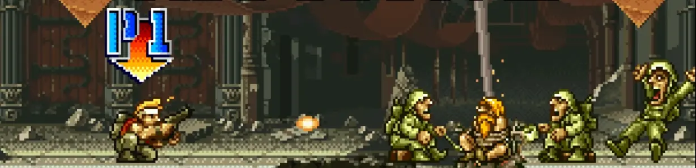

+++
date = '2025-02-15T11:46:24+01:00'
draft = false
title = "On Metal Slug 1: Mixing Run 'n Gun Combat With Vehicle Combat"
summary = 'Nazca follows up a game where you can only control a submarine with a game where you control either a tank or a footsoldier. How does it pan out?'
tags = ['game design', 'arcade', "run 'n gun", "metal slug", "nazca"]
ShowCanonicalLink = true
CanonicalLinkText = 'Originally published at'
canonicalURL = 'https://www.backloggd.com/u/Durandal/review/1129557/'
blueskyPostUri = 'https://bsky.app/profile/testamentenjoyment.bsky.social/post/3l7aqo3bysx2t'
listEntryImage = './catalog-cover.webp'
+++

We love fixed attack angles! As fun as it can be to control hordes of enemies coming in at every angle, there’s an equal amount of joy in jockeying player characters with limited angles of attack into a perfect position against deviously placed enemies. And there’s no better example of this dynamic than controlling a **SUPER VEHICLE-001 METAL SLUG**.

The firing angle of your Slug’s turret turns as you move (or hold up/down), which makes the act of realigning your firing angle intrinsically tied to movement, and in turn intrinsically ties it to every other threat in the game that’s locking down your position. Backing up to turn your turret backwards may not always be safe when there’s a grenade or mine behind you. That the Slug’s cannon can only fire towards the right side of the screen creates an asymmetric situation where enemies coming from the left must be handled differently than those from the right. Given this fact you’re always trying to figure out how to maneuver enemies in front of your cannon. Figure it out, and you’re rewarded with *juicy damage*. The coolest example of this has to be the stage 4 boss in Metal Slug 2/X, where if you narrowly avoid being hit by its cannon shells, [you can have your Slug *ride the shockwave of the explosion* to propel yourself upwards and so get a perfect cannon firing angle at the boss’ weak point](https://youtu.be/U1IAqkjy9v8?t=938). Therein lies the joy of controlling an unwieldy massive thing: of getting it to do exactly what you want to and using it to systematically dismantle situations at full speed. Having to deal with multiple high-HP targets approaching you from multiple uncomfortable angles is where Slug combat shines.

With your angles of attack being limited, naturally the game keeps placing enemies in off-angle positions. The uneven stage terrain is crucial to making this dynamic work. Stage elements like barricades, slopes and trenches aren’t merely decorations, but actual hazards that serve to obfuscate getting a clean shot on the enemy (and vice versa!)[^1]. After all, in a game where your main attack angles are limited to the cardinal directions while on-foot or a limited turning speed in the Slug, controlling a situation where the stage terrain is completely flat would be too straightforward. If the enemies directly spawned into your line of fire, you would only need to hold down the fire button and move forwards without a thought. This is precisely why during moments where the terrain *is* flat, Metal Slug prefers to spawn enemies from above or below rather than from the left or right, playing with the fact that you can only shoot directly upwards.

Another key to making this dynamic work is there is no single weapon that can easily or consistently cover large parts of the screen. All weapons you get via POW drops are weak in at least one area[^2], and you can only carry one at a time. Arguably the Slug has the most versatility with its all-range Vulcan Gun and powerful Cannon blasts, but this means having to pilot the big unwieldy Slug. The fact that no weapon can quite consistently cover any given situation is what forces the player to engage with the dynamic of negotiating terrain and enemy placements at all, instead of it turning into a game holding down the fire button and running forwards. Powerful screen-covering weapons like Contra’s Spreadgun or Ninja Spirit’s Kusarigama work well within their own “shoot down enemies coming from every direction” context, but in the “jockeying for the proper firing angle” context of Metal Slug, it’s easy to see how such powerful weaponry could negate a lot of Metal Slug’s mechanical nuances.

Now controlling a big unwieldy thing with limited angles of attack is fun and all, but that still leaves the question of how you are supposed to avoid getting hit in such a thing. Metal Slug’s answer is as follows: *ejecting from the Slug gives you a generous amount of i-frames, and the Slug will not collide with any enemy attacks if you are not piloting it*. It’s these details that render Slug combat playable at all and what prevent it from turning into a battle of attrition. Consider the following. As enemy attacks in Metal Slug had to be designed to be (mostly) reactable and avoidable on-foot, being unable to avoid such clearly avoidable attacks in the Slug would not feel right on a visceral level. The amount of babysitting that would be required for the Slug to not take any hits would at worst be borderline impossible with the already cramped screen space of the game, and at best reinforce an incredibly slow and passive playstyle if you want to keep your Slug. That ejecting from the Slug makes you briefly invincible and the Slug does not collide with any attacks is the magic glue that gets around these issues and makes the interplay of on-foot/vehicle combat all work. (Which only makes it even more baffling that the game doesn’t really tell you or show you something as essential as ejecting from the Slug making you invincible…)

While we’ve covered the dynamics of jockeying for the right firing angle, we haven’t talked much about how to deal maximum damage *once* you get that firing angle. This is where things start getting dicey…

You see, grenades deal a lot of damage but are normally balanced by a projectile limit of two grenades on-screen per player. However, this means that if you throw grenades at an enemy point-blank so they detonate right as you throw them, you can essentially throw grenades as fast as you can hit the fire button. *That* means that if you position yourself in an enemy’s face, you can deal **ludicrous damage**.

This gets even more nuts when you’re piloting a Slug, because while crouching in the Slug you throw grenades instead of firing cannon shells, and **while in the Slug, the on-screen projectile limit for grenades is completely lifted**! This technique is so powerful that you can demolish barriers in seconds and speedkill certain bosses before they can even get a real shot off! This gets particularly interesting against flying enemies such as the stage 2 boss or final boss, as you’re first trying to climb (your Slug) up platforms where your grenades can connect with the enemy aircraft. It’s an identical dynamic to what I described at the start of this article (w/r/t aligning your Slug’s cannon with a boss for bonus damage), except this one can also be done while on-foot. The only thing that keeps this technique in check is that you don’t have infinite grenades, as they can only be replenished from saving certain POWs or as drops from specific enemies. Sounds cool, right? Well…

It *is* cool that it gives you another avenue for optimizing damage and clear time, but there’s also such a thing as *too much* damage. If the nadespam technique is so powerful to the point of letting you skip otherwise fun and interesting encounters, then its existence is more of a net negative than anything. That said, skipping or bulldozing encounters outright can be acceptable if it’s challenging to pull off (which most applications of nadespam aren’t) or if it involves skipping encounters in the first quarter of the game that were easy by design and pose no huge challenge to experienced players anyways. The developers must have realized how overpowered this was, as they nerfed this starting from Metal Slug 2/X[^3]. Of course, one can simply choose not to use nadespam in order to keep these challenges intact. To reference the Xeet of the official Doom Xwitter account: “[you control the buttons you press](https://twitter.com/DOOM/status/1187480003635744768?lang=en)”. But this also comes at the cost of depriving yourself of the otherwise fun dynamic of point-blanking grenades for bonus damage! It’s not that it is inherently unfun, merely that it is unfortunately overpowered and creates balance issues out of the wazoo.

When you can stockpile and spend a powerful resource to such an extent, it is not only too powerful, but also leads to an incredibly all-or-nothing power curve that’s impossible to balance around[^4]. Take the final boss, for example. If you enter with a Slug and a good stockpile of grenades, it’s an excellent boss fight! You’re constantly jockeying your Slug up the platforms where you can get in position where your grenades and cannon shells can hit the boss, all the while dealing with homing missiles or direct shots impeding you--having to always calculate if it’s safe enough to squeeze in more damage or if it’s time to GTFO. But if you enter on-foot or die during and are reset to your peashooter pistol with only 10 grenades? WORST BULLETSPONGE BOSS EVER. An excruciatingly long fight with little means to optimize your damage as you’ll be out of nades immediately unless you get lucky with the item drops from the POWs (who only spawn in at bosses during set but long intervals). Then you get the stage 3 boss. Without nadespam you get a fun fight about dodging lasers from below and mines to your sides, but with nadespam you can kill it before it even fires its big gun. That’s the problem with all-or-nothing power curves: do you balance the game around the player being full power, or not? You could somehow try both as Metal Slug did, but it’s not a satisfactory solution. At the start you get encounters and bosses that are tuned to be still fair even if you die and can’t nadespam but die easily if you do, and at the end you get the exact opposite. Encounters are then balanced around nadespam or entering with your Slug by having enemies with tons of health, meaning they become painfully drawn out if you do end up losing or wasting all your grenades, Slugs, and weapons.

Is it then the fact that you lose most of your resources on death that lies at the root of this all-or-nothing power curve? For experienced players it might be, but for new or learning players who have yet to learn a route optimizing item drops? I doubt it. An experienced player will know when and where to use grenades, and knows how and when to get item drops from POWs. But once a learning player runs out of ammo/grenades or gets their Slug blown up **even without dying**, then what? Optimizing damage with grenades or your Slug, ejecting from your Slug as a makeshift defensive maneuver--those are dynamics that are now temporarily *gone*[^5]. The fact these are based on limited resources (that aren’t easily replenishable) means that running out not only depowers you but also gives you less tools to play the game with. This *could* work if grenades were easier to replenish and Slugs easier to keep with you, but that is simply not the case.

Even without the harsh punishment on death, there’s still a necessary memorization burden that needs to be overcome if you want to not die and face a challenge with all the tools in your arsenal, but what exactly is gained from placing such a “you either know or you don’t” burden on the player? Of course, there will always be optimizations in games that are largely a matter of knowing, but to then make them mandatory if you want to play the game with all tools at your disposal? All that accomplishes is expediting the learning process—it doesn’t make the game more interesting. It certainly might be more profitable to an arcade operator, though[^6].

If anything, I would say the real problem with Metal Slug is that **it treats elements like the Slug or grenades or your weapons as limited power-ups rather than as core parts of your toolset**. By designing the game around them being limited, or more specifically, around them possibly not being available to you *at all*–the game inherently limits the scope for how they can be used and how the game can challenge your usage of them. The game cannot–without severe concessions–design challenges around something you may have no access to at all. It is not that they are limited by resources at all that’s the issue, but rather that it’s a realistic possibility that you might not have access to these tools for noticeable periods of time. Nearly all PC FPS games in the 90s had limited ammunition for their weapons, but they were usually still designed in a way where if you played reasonably, you’d always have more than enough ammunition for your workhorse weapons. Encounters could be designed around the assumption that the player at least had access to those weapons, and that is precisely something that Metal Slug cannot assume. For example, a stage specifically designed around Slug combat can never really go all-out with the encounter design because of the risk that the player ends up permanently losing the Slug (which is partially why Stage 4, which gives you a Slug from the start, feels like it’s holding back the whole time). It can only clumsily try to design around them being both available and unavailable, which inherently limits the scope of the stage design than if it was something that was always readily available or almost never at all.

If these limited tools in Metal Slug were then more easily replenishable or weren’t limited by resources at all, then not only would it lighten the memorization/routing burden significantly, but it would also provide a more predictable set of tools to design stages around. If grenades are a tool that are nearly always available to you, then it’s easier to set enemy health values balanced around the existence of nadespam, and to have stages more thoroughly explore the application of grenades. If the Slug was a tool that was more readily available to you, then we could have more stages that more thoroughly explore the possibilities of vehicle gameplay or on-foot/vehicle interplay.

This would all require a more radical re-examination of Metal Slug’s gameplay formula, which at a glance is unfortunately not something I’ve seen the sequels try to attempt. Metal Slug’s formula certainly has potential that certainly shines through, but if it really wants to get there it should treat its own tools more as fixed parts of its toolset. I should note that it is still possible to take the long-term resource management route, that your ammo and the state of your Slug(s) carry over between stages and have multiple nuanced means to be managed, but this is also something that, again, requires a radical re-examination of the formula.

[^1]: Slopes especially affect your Slug, as the firing angle of your cannon is relative to the orientation of your Slug.

[^2]: For example: The Shotgun is powerful and fires in a wide cone but lacks range and rate of fire. The Flame Shot penetrates enemies in a straight line but lacks damage. The Heavy Machine Gun can cover diagonal angles but also lacks damage. The Missile Launcher homes in on enemies, but it has an on-screen projectile limit that effectively limits its rate of fire at longer distances.

[^3]: In Metal Slug 2/X they added a maximum rate-of-fire limit to throwing grenades from a Slug specifically (there the rate of fire isn’t even tied to the number of grenades on-screen like when you’re on foot, so whether you point-blank nadespam in a Slug or not doesn’t matter!). In doing so they curbed the maximum potential power of this technique, but this also added the interesting nuance where if you do want to nadespam, you’d have to eject from the safety of the Slug and dump grenades point-blank on foot.

[^4]: Now, I do think it’s possible to make games with an all-or-nothing power curve without it turning into a balancing nightmare, and I think it relies on the speed with which you go from 0 to 100 and vice versa. Take something like Psyvariar, where you’re always playing on the razor’s edge of grazing bullets for brief but absolute invincibility as a reward. In Psyvariar you get real powerful real fast, but it requires constant focus to keep up and can be lost just as quickly. Designers can reasonably predict the player’s power levels and balance encounters around this, as the player can go from 0 to 100 at any time. Metal Slug’s power curve by contrast is slowly built-up using items you pick up throughout the stage. Once you’re fully powered-up it’s hard to lose your advantage, but if you do, the recovery from death is lengthy and crushing. Playing well then feels too rewarding while making a mistake feels too punishing. Encounters are either balanced around you being at full power, or they are not. Deaths can thus quickly spiral into a game over; staying at full power ends up feeling less like a reward and more like a requirement.

[^5]: Such ‘debuffs’ where you are temporarily locked out from using certain tools or moves *can* be interesting, as they can force you to change and improvise your strategy in the middle of a perilous situation. One example I like is how getting hit by Pukers in Dead Space 2 briefly disables your ability to sprint, thus forcing you to stand your ground against enemies instead of trying to create distance as you normally would. However, these kinds of debuffs only make the game more interesting if they still leave you with enough tools to let you approach a situation in interesting and nuanced ways. A debuff that for example transforms you into a weak character (such as a chicken) that can only do one or two moves is likely not going to bring many nuances to the gameplay. A pistol-only Metal Slug run then won’t have the same depth as if you had access to your full arsenal, let alone the appeal of what makes Metal Slug’s gameplay unique.

[^6]: Arcade games do tend to be unfairly put down as ‘quarter munchers’ by Western audiences (even though there is actual precedent for that in Western arcade halls specifically, but that’s a story for another time), however the fact remains that for arcade operators credits need to flow one way or another. One common resulting design tendency in arcade games was to look the other way when it comes to deaths spiraling into one another–something that’s also known as [Gradius Syndrome](https://atrociousgameplay.miraheze.org/wiki/Gradius_Syndrome). Games by Irem (the parent company that Team Nazca, the developers of Metal Slug, split off from) were rather notorious for this. You’d get a ton of games that–if you were at full power–were still technically fair, but if you died once you’d better hope you died at a spot where you could still recover your items, otherwise you could kiss your run goodbye. Arcade-style games originally developed for home systems have been less likely to exhibit this tendency, now that they no longer operate on actual quarters.
